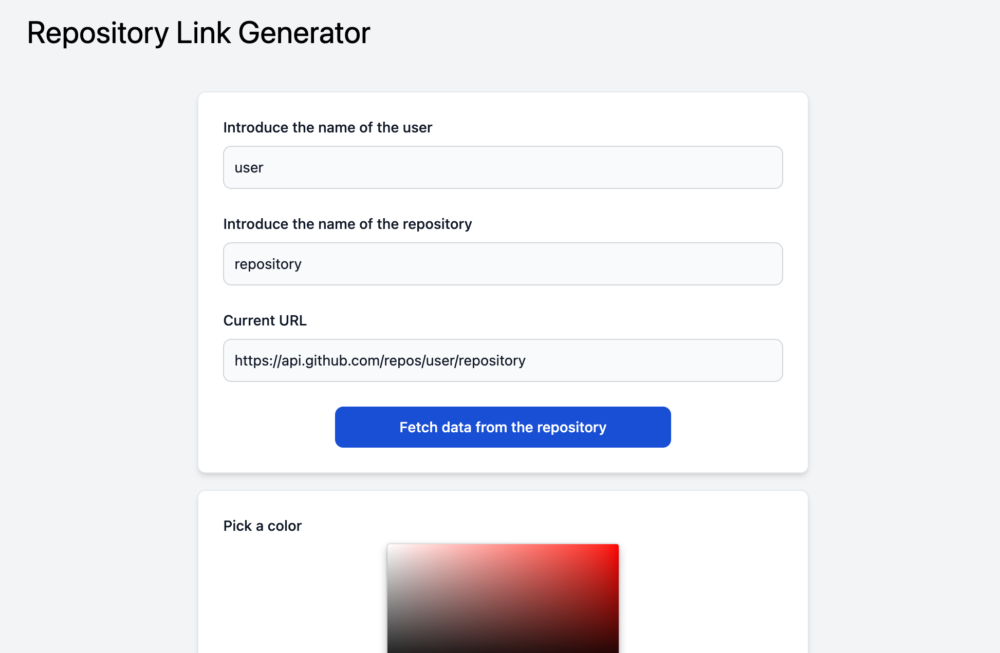
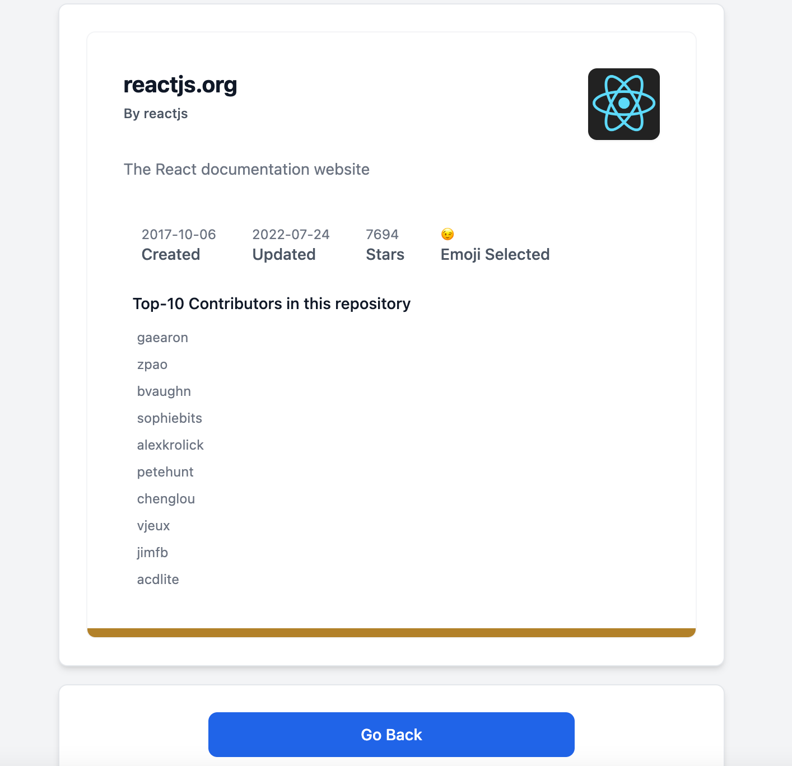

## Task - Repository Link Preview | Frontend-Exercise
### Coding challenge

[Alvaro Hernandez](mailto:alvarohernandezassens@gmail.com)
## Proposed Solution

### [Click here to see the Live Demo](https://repo-links.vercel.app/)
## Screenshots

## Libraries / Tools Used

- Next.js
- Create Next App
- Typescript
- Tailwind
- React Icons

## Frontend Setup

To install the dependencies run in the folder:

`npm install` or `yarn install`

And to run the app:

`npm start` or `yarn start`

## Running the tests

You can run the unit tests using:

`npm test` or `yarn test`

## Future Work

- Input Data validation.
- Add spinners and animations (e.g. after fetching data).
- Display success and error messages properly.
- Add testing with Jest and React-Testing-Library.